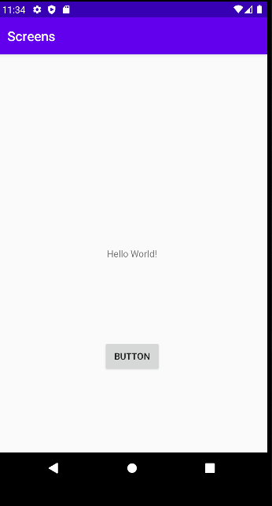
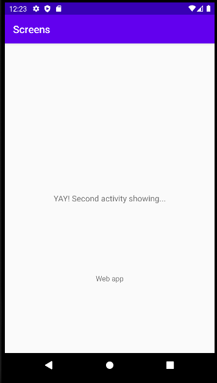

# Rapport

Det första steget till skapandet av appen var att lägga till en ny aktivitet. Detta gjordes genom att trycka på File > New > Activity > Empty Activity,
som lade till kodsnutten android:name=".NewActivity" nedan i AndroidManifest.xml. Detta är den nya aktiviteten.

    <application
    ...
        <activity
            android:name=".NewActivity"
            android:exported="false" />
        <activity android:name=".MainActivity" >
    ...
    </application>

Efter detta steg lades en knapp in i activity_main.xml som senare kommer kunna användas för att ta användaren till en ny sida. Koden för tillägning
av knappen finns nedanstående. Denna får constraints som förhåller sig till parent samt till botten av elementet textView, och placeras enligt bilden nedan.
Knappen får texten "Button" och id button_startActivity.

    <Button
        android:id="@+id/button_startActivity"
        android:layout_width="wrap_content"
        android:layout_height="wrap_content"
        android:text="Button"
        app:layout_constraintBottom_toBottomOf="parent"
        app:layout_constraintEnd_toEndOf="parent"
        app:layout_constraintStart_toStartOf="parent"
        app:layout_constraintTop_toBottomOf="@+id/textView" />

Bileden ovan presenterar button från activity main sidan. 

För nästa steg skapades klassen NewActivity. I denna beskrivs det vad som ska ske när denna är exempelvis kallad på. 
I koden nedan säger den att layouten ska vara activity_new när klassen är kallad och närvarande, vilket är layouten för den
nya aktiviteten. 

    @Override
    protected void onCreate(Bundle savedInstanceState) {
        super.onCreate(savedInstanceState);
        setContentView(R.layout.activity_new);
    }

Med nedanstående kod skapas en intent som sedan kan användas för att för att klassen NewActivity ska startas 
vid klickning. För att appen ska veta vilken klickning som den ska reagera på används följande kod som
bestämmer att den knappen som tidigare sattes ut är kopplad till just denna funktion. 
    
     Button button = findViewById(R.id.button_startActivity);
        button.setOnClickListener(new View.OnClickListener(){

Inom intent.putExtra finns name samt year, där dessa är extra data som skickas med när appen
byter till den andra aktiviteten. Ytterliggare information som utges med kodsnutten nedan är att
vid själva klickningen ska intent starta, vilket innebär att den nya aktiviteten ska visas. 

    @Override
    protected void onCreate(Bundle savedInstanceState) {
        super.onCreate(savedInstanceState);
        setContentView(R.layout.activity_main);
        Button button = findViewById(R.id.button_startActivity);
        button.setOnClickListener(new View.OnClickListener(){
            @Override
            public void onClick(View view) {
                Intent intent = new Intent(MainActivity.this, NewActivity.class);
                intent.putExtra("name", "Web app");
                startActivity(intent);
            }
        });
 

Tidigare kod har använts för att skapa en ny aktivitet och intent med data som ska skickas till den nya aktiviteten vid klickning 
på knappen. För att datan ska kunna visas gjordes ändringar och tillägg i activity_new.xml samt NewActivity klassen.
Med den nedanstående koden tagen från NewActivity.java har TextView textview = findViewById(R.id.textViewName);
lagts till. Denna hittar vilken TextView som ska visa datan. Datan hämtas baserat på nyckeln "name" och kan displayas
på sidan. 

    @Override
    protected void onCreate(Bundle savedInstanceState) {
        super.onCreate(savedInstanceState);
        setContentView(R.layout.activity_new);
        TextView textview = findViewById(R.id.textViewName);

        Bundle extras = getIntent().getExtras();
        if (extras != null) {
            String name = extras.getString("name");
            textview.setText(name);

        }

Med denna TextView kan datan presenteras visuellt på appens sida som i detta fall kommer vara "Web app". 

    <TextView
    android:id="@+id/textViewName"
    android:layout_width="wrap_content"
    android:layout_height="wrap_content"
    android:text="TextView"
    app:layout_constraintBottom_toBottomOf="parent"
    app:layout_constraintEnd_toEndOf="parent"
    app:layout_constraintStart_toStartOf="parent"
    app:layout_constraintTop_toBottomOf="@+id/textView1" />

I bilden nedan visas den andra aktiviteten med den tillagda datan. 

Bilder läggs i samma mapp som markdown-filen.

,](android.png)

